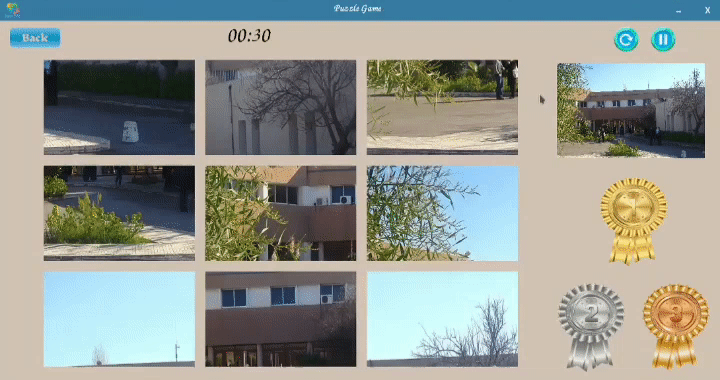

<div align="center">
  <h1>🧩 Jigsaw-PyQt</h1>
  <p>A fun and interactive Jigsaw Puzzle game built with Python and PyQt5. Choose your difficulty level, race against the clock, and beat your best times!</p>
</div>

<br />

## 🎮 Demo

<div align="center">
  
</div>

<br />

## ✨ Features

- **Multiple Difficulty Levels**: Test your puzzle-solving skills with customized difficulties: *Easy*, *Medium*, *Hard*, and *So Hard*.
- **Best Time Tracking**: The game automatically tracks and saves your best times for each difficulty level locally on your machine.
- **Interactive UI**: A vibrant, responsive, and user-friendly graphical interface powered by PyQt5.
- **Built-in Demo Viewer**: Includes an integrated GIF display to quickly showcase gameplay right from the main menu.

## 🛠️ Prerequisites

To run this project, you need:
- **Python 3.x**
- **PyQt5**

## 🚀 Installation & Running

**1. Clone the repository**
```bash
git clone https://github.com/yourusername/Jigsaw-PyQt.git
cd Jigsaw-PyQt
```

**2. Set up a virtual environment (Recommended)**
```bash
python -m venv venv

# On Windows:
venv\Scripts\activate

# On macOS/Linux:
source venv/bin/activate
```

**3. Install dependencies**
```bash
pip install -r requirements.txt
```

**4. Start the game!**
```bash
python src/main.py
```

## 📁 Project Structure

```text
Jigsaw-PyQt/
├── src/                # Python source code for the game
│   ├── main.py         # Entry point of the application
│   ├── mainwindow.py   # Main menu interface
│   ├── puzzlepanel.py  # Core puzzle logic and rendering
│   ├── setlevel.py     # Difficulty selection
│   ├── gifdisplay.py   # Built-in demo player
│   └── ...
├── demo4.gif           # Gameplay demonstration GIF
├── requirements.txt    # Python package dependencies
└── README.md           # You are here!
```

---

<div align="center">
  <i>Made with ❤️ using Python & PyQt5</i>
</div>